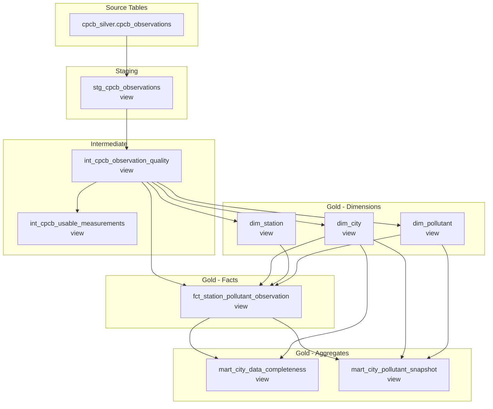

# India AQI — dbt Model Lineage

Generated automatically from target/manifest.json.

```mermaid
flowchart TD

    subgraph SRC["Source Tables"]
        S0["cpcb_silver.cpcb_observations"]
    end

    subgraph STAGING["Staging"]
        M8["stg_cpcb_observations<br/>view"]
    end

    subgraph INTERMEDIATE["Intermediate"]
        M4["int_cpcb_observation_quality<br/>view"]
        M5["int_cpcb_usable_measurements<br/>view"]
    end

    subgraph GOLD__DIMENSIONS["Gold - Dimensions"]
        M0["dim_city<br/>view"]
        M1["dim_pollutant<br/>view"]
        M2["dim_station<br/>view"]
    end

    subgraph GOLD__FACTS["Gold - Facts"]
        M3["fct_station_pollutant_observation<br/>view"]
    end

    subgraph GOLD__AGGREGATES["Gold - Aggregates"]
        M6["mart_city_data_completeness<br/>view"]
        M7["mart_city_pollutant_snapshot<br/>view"]
    end

    %% Model dependencies
    M4 --> M0
    M4 --> M1
    M4 --> M2
    M4 --> M3
    M0 --> M3
    M2 --> M3
    M1 --> M3
    M8 --> M4
    M4 --> M5
    M3 --> M6
    M0 --> M6
    M3 --> M7
    M0 --> M7
    M1 --> M7
    S0 --> M8

```